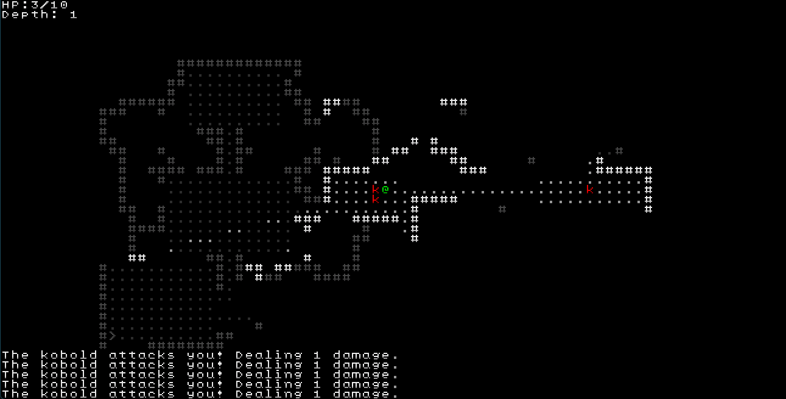

# Kicking Kobolds

### Nuzcraft participates in the RoguelikeDev subreddit tutorial series

Announcement post [here](https://old.reddit.com/r/roguelikedev/comments/1luh8og/roguelikedev_does_the_complete_roguelike_tutorial/). I'm starting a week or two behind, but I'm looking forward to the project.

I'm using [prism](https://github.com/PrismRL/prism), a new roguelike engine for LOVE. 

There is no dev log - I'm awful at writing as I go so this is a retrospective on the tutorial.

## Tutorial Retrospective

The tutorial series starts [here](https://prismrl.github.io/prism/making-a-roguelike/part1.html). There is a template project to start from [here](https://prismrl.github.io/prism/installation.html). One of the prism developers responded to my feed back [here](https://github.com/nuzcraft/stunning-banana-tree/issues/14).

I first tried to recreate the template with building blocks I could understand. 

**There were dependencies that I didn't understand which kept me from starting from scratch.**

Foreshadowing... I think many of my personal issues with the engine will come down to *not understanding how all the pieces fit together*. That's not a bad thing; it's a hurdle I haven't overcome yet. It doesn't help that I'm only a couple months into using Lua or LOVE. 

***from the dev:** We’ll eventually have a “starting from absolute scratch” guide that walks you from nothing to the current Prism template. The interaction between the UI and the rules engine is non-trivial, which is why the template projects hide it for newcomers. This isn’t unusual most engines expect you to start from their base project, but I understand the frustration of not seeing the underlying connections.*

**I like the architecture; it helps each *thing* be responsible only for its little bubble of influence.**

A good architecture diagram is [here](https://prismrl.github.io/prism/architecture-primer.html). One thing I do in other projects is put movement logic for actors within the actor object. This makes sense; the actor is the one moving so they should check to see 'can I move here' and choose how to handle the response. Prism doesn't handle it this way. Since the level holds both actors and the cells/terrain, prism uses the level to perform actions like movement. In this way the actor and action can be defined away from the level with more independence and flexibility than if they were more tightly coupled. This notion extends to the rest of the architecture.

***from the dev:** That’s exactly what we were aiming for: low dependency and high encapsulation.*

**I like the use of small components and systems.**

I don't have much experience with ECS, and even though I've primarily worked with Godot, I'm woefully underpracticed at using components well. Prism relies on small, specific components, which invites creativitiy and flexibility into the game design process. Similarly, systems are meant to be small and specific, which allows for flexibility without overhead. I've some plans to continue Kicking Kobolds to put some of this into practice.

***from the dev:** This is where a lot of flexibility comes from. For example, you can put Item and Controller on the same Actor and suddenly you’ve got a critter you can pick up and drop into your inventory with no extra code. That kind of composability was a core goal.* 

**I don't like volume between starting a feature and testing a feature.**

This is present throughout the engine, but I found it very visible in [part 11](https://prismrl.github.io/prism/making-a-roguelike/part11.html) of the tutorial where we set up consumables. It takes a lot of code (and a lot of opportunities to make a mistake) before you can really test anything.

1. create `heal` function on `Health` component
2. create `Edible` component
3. create `Eat` action
4. add `Edible` component to actor
5. add `InventoryActionState` game state

Only after all 5 steps could you really test that any one bit was working correctly. There are probably some shortcuts or some unit testing or something that I'll discover to short-circuit this problem so that I can figure out if `Edible` was set up correctly or if the `Eat` action isn't quite working right sooner.

***from the dev:** That flexibility does come with some ergonomic tradeoffs, and verbosity is one of them. We’re working to identify the worst offenders and make them more streamlined where we can.*

**I don't know when the folder structure matters.**

Based on [this](https://prismrl.github.io/prism/how-tos/object-registration.html), I think the `module/game` directory is the only place where the folder structure is defined by prism and has some predefined folder names. In the tutorial it wasn't clear when we made new files in a specific location because they have to be there, its best practice for them to be there, or it doesn't matter where they are so we just put them there. I don't think this is a huge deal, and I'm sure it'll become clearer with some more practice.

***from the dev:** You’re right, only a few folders have strict rules:*
- *modules/game*
- */actors*
- */components*
- */etc*

*Inside those, Prism just recursively loads .lua files. The structure beyond that is up to you. For example:*
- *modules/game/actors/goblins*
- *goblin.lua*
- *goblinarcher.lua*
- *goblinmage.lua*

*Here, the grouping is purely for your own organization; Prism doesn’t care as long as the files are in the right base folder.*

## Conclusion

I have had a good time with this engine. I like using it and I want to continue. I have some plans to expand the Kicking Kobolds demo to help me continue learning. I definitely experienced some growing pains and some frustrations that stemmed from *not understanding how all the pieces fit together*, but those issues do not overshadown the notion that this is a fun engine to work in that is doing some really cool things.
